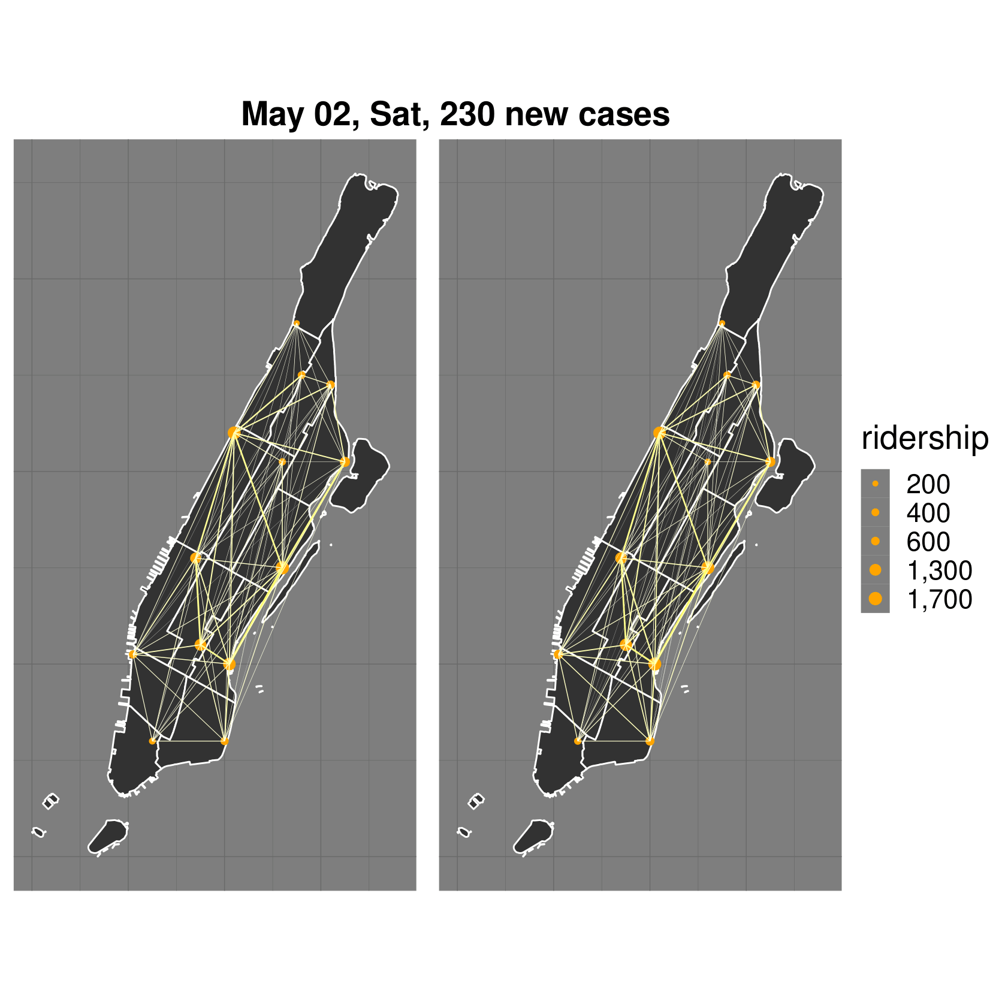
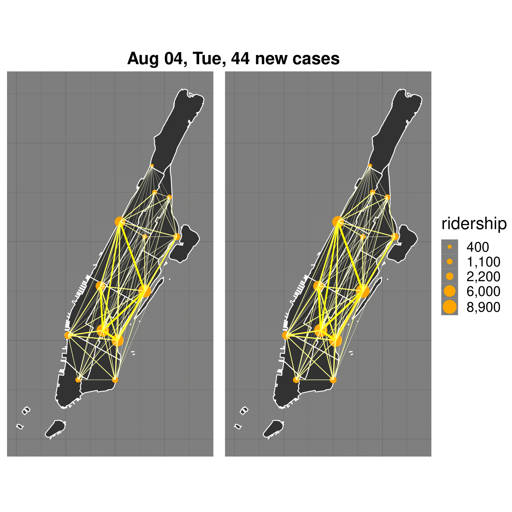
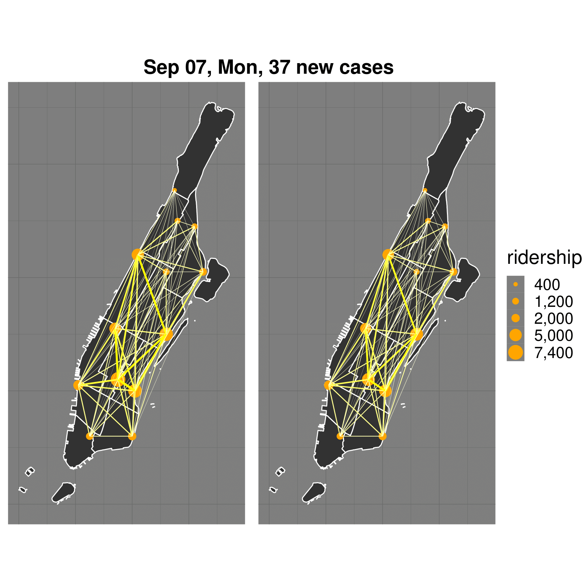
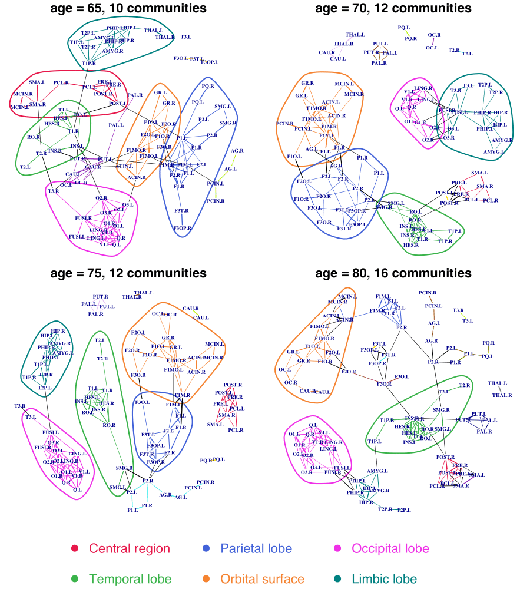

# Network-Regression-with-Graph-Laplacians
This repository contains the implementation for the paper ["Network Regression with Graph Laplacians"](https://www.jmlr.org/papers/volume23/22-0681/22-0681.pdf) in R.

## Summary of the paper

Network data are increasingly available in various research fields, motivating statistical analysis for populations of networks where a network as a whole is viewed as a data point. The study of how a network changes as a function of covariates is often of paramount interest. However, due to the non-Euclidean nature of networks, basic statistical tools available for scalar and vector data are no longer applicable. This motivates to extend the notion of regression to the case of responses that are network data. Here we propose to adopt conditional Frechet means implemented with both global least squares regression and local weighted least squares smoothing, extending the Frechet regression concept to networks that are quantified by their graph Laplacians. The challenge is to characterize the space of graph Laplacians so as to justify the application of Frechet regression. This characterization then leads to asymptotic rates of convergence for the corresponding M-estimators by applying empirical process methods. We demonstrate the usefulness and good practical performance of the proposed framework with simulations and with network data arising from resting-state fMRI in neuroimaging, as well as New York taxi records.

<p float="left">
 



</p>

**Figure 1**: True (left) and fitted (right) networks on May 2, Jun 25, Aug 4, and Sep 7, 2020 (from top left to bottom right). The corresponding days and the number of COVID-19 new cases are in the headline of each subfigure.



**Figure 2**: Topological representation using spectral community detection for predicted functional connectivity networks at different ages (years). The communities with no less than 10 ROIs are highlighted using colored polygons. These communities are found to be associated with different anatomical regions of the brain.

## File Overview
- `src/`: implementation for the paper ["Network Regression with Graph Laplacians"](https://www.jmlr.org/papers/volume23/22-0681/22-0681.pdf) in R.
  - `gnr.R` Global regression for network data quantified by graph Laplacians with Euclidean predictors.
  - `lnr.R` Local regression for network data quantified by graph Laplacians with Euclidean predictors.
  - `kerFctn.R` Kernel function called by `lnr.R`.
- `severn/`: R codes for methods in
  - Severn, K.E., Dryden, I.L. and Preston, S.P., 2022. Manifold valued data analysis of samples of networks, with applications in corpus linguistics. The Annals of Applied Statistics, 16(1), pp.368-390.
  - Severn, K.E., Dryden, I.L. and Preston, S.P., 2021. Non‐parametric regression for networks. Stat, 10(1), p.e373.
- `data/`: This folder contains part of the data used in the first data application of the paper : New York Yellow Taxi System After COVID-19 Outbreak.
  - `NYC_cases_by_day.csv`: NYC Coronavirus Disease 2019 (COVID-19) data (publicly available at [https://github.com/nychealth/coronavirus-data](https://github.com/nychealth/coronavirus-data)) where one can find citywide and borough-specific daily counts of probable and confirmed COVID-19 cases in New York City since February 29, 2020.
  - `yellowTripdata2020`: The yellow taxi trip records (publicly available at [https://www1.nyc.gov/site/tlc/about/tlctrip-record-data.page](https://www.nyc.gov/site/tlc/about/tlc-trip-record-data.page)) on pick-up and drop-off dates/times, pick-up and drop-off locations, trip distances, itemized fares, rate types, payment types and driverreported passenger counts, collected by New York City Taxi and Limousine Commission (NYC TLC).
- `simulation.R`: all R codes used in simulation.
- `taxi.R`: R codes for the first data application of the paper: New York Yellow Taxi System After COVID-19 Outbreak.

## Citation

Please cite our paper
["Network Regression with Graph Laplacians"](https://www.jmlr.org/papers/volume23/22-0681/22-0681.pdf)

``` 
@article{zhou2022network,
  title={Network Regression with Graph Laplacians},
  author={Zhou, Yidong and M{\"u}ller, Hans-Georg},
  journal={Journal of Machine Learning Research},
  volume={23},
  number={320},
  pages={1--41},
  year={2022}
}
``` 
